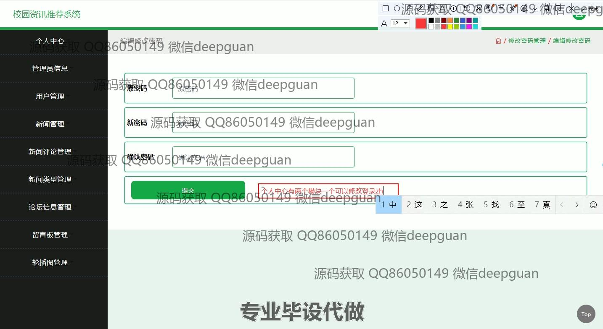
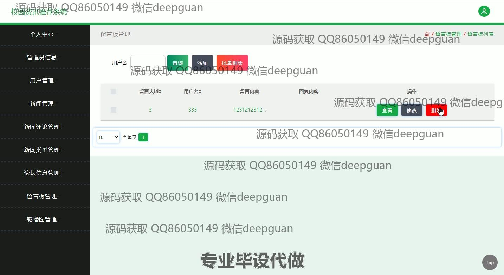

<h1 align="center">校园资讯推荐系统</h1>

## 简介
校园资讯推荐系统：角色分为管理员、用户；主要功能包括新闻管理、用户管理、论坛信息管理、留言板管理及评论互动，提升校园信息的分享与交流效率。    --计算机毕业设计源码；毕设源码；java毕业设计源码

## 联系方式

<h3 align="center">获取完整代码与数据库文件 + 微信：deepguan QQ: 86050149 QQ群: 783742310</h3>

<h3 align="center">可帮忙远程部署 包运行成功！提供远程部署、修改代码、设计文档指导、代码讲解等服务！</h3>

## 功能介绍（完整见运行截图）
管理员：管理员可以访问并管理用户信息，新闻管理，新闻评论管理，新闻类型管理，论坛信息管理，留言板管理和轮播图管理等模块。此外，管理员能够添加、修改和删除用户信息，查看或批量删除留言与评论，更新新闻条目，以及进行后台配置，确保系统的正常运行与信息的及时更新。管理员还可以通过系统的功能菜单快速导航到各个管理模块，高效地进行信息和内容的管理。

普通用户：普通用户可在系统中注册账户并登录，随后在个人中心修改个人信息，如账户名、密码等。用户能够访问校园资讯，如新闻、论坛及留言板等，进行评论和互动。用户可以发布留言反馈，用留言和评论功能与其他用户交流，提高校园信息分享的效率。同时，用户也可以浏览并参与论坛讨论，通过简洁的用户界面轻松获取所需的资讯。

高级用户：高级用户具备普通用户的所有功能，此外可以在论坛中管理自己的帖子，编辑个人信息，并上传个人照片。高级用户能够通过更丰富的互动功能进行社会化交流，并能够对新闻及论坛的信息进行评论回复，参与校园信息的生成与传播。高级用户同样可快速跳转至前台与后台进行关联操作，灵活掌握信息动态。

访客：访客无需注册即可浏览系统首页，查看基本的校园资讯，获得系统的基本信息介绍。然而，访客无法进行个性化互动，也不能发表评论或留言；要享受完整的系统功能，需通过注册和登录成为用户。访客模式简化了信息获取的流程，便利了对系统的初步了解，提升用户的注册与使用意愿。

## 运行截图

本代码来源于网络,仅供学习参考使用!

